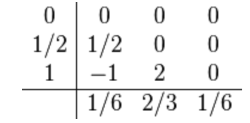

# Lab 7
## Runge-Kutta I

Kutta's third order method has the coefficients

and consists out of two RK methods of order two and three. Both RK methods differ only in the weights *b_i*.

We want to use this method to find a stationary solution to the nonlinear Schrödinger equation

of the type

where \eta > 0.

In order to find  you have to insert the Ansatz for  into the time-dependent equation above. This yields a second order ordinary differential equation for . Assuming that
 as
 we can find an analytic asymptotic expression for . From the asymptotic expression we can generate initial conditions for the ODE integration.

Write a program which implements both RK methods as stated above. Output the solution from both algorithms.

Note: The solution for this problem can also be obtained analytically as

